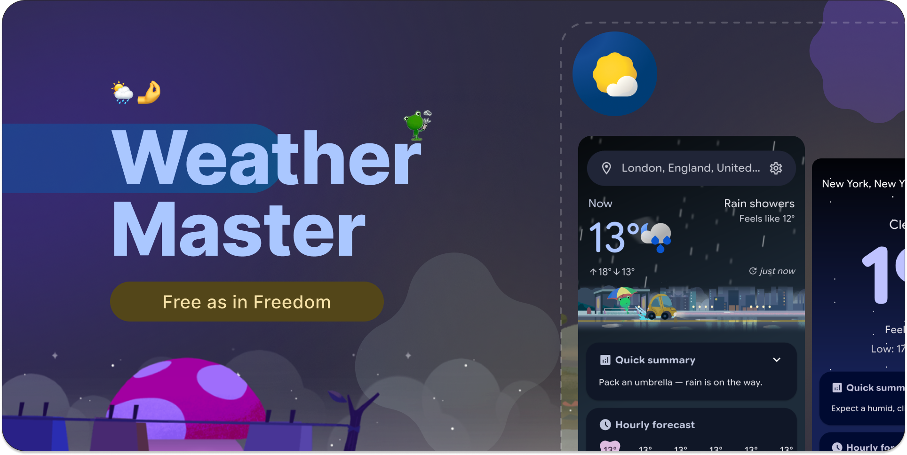
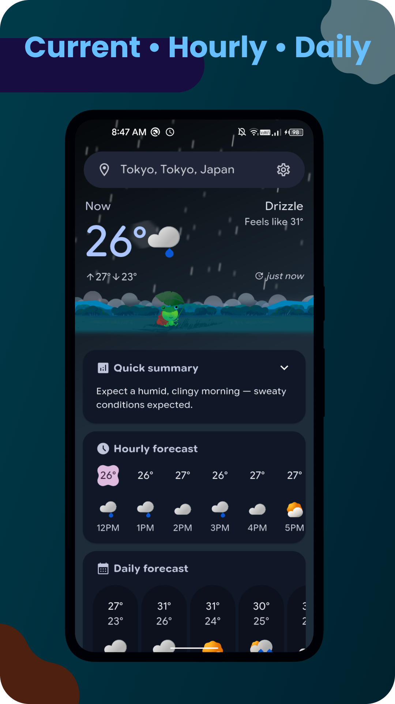
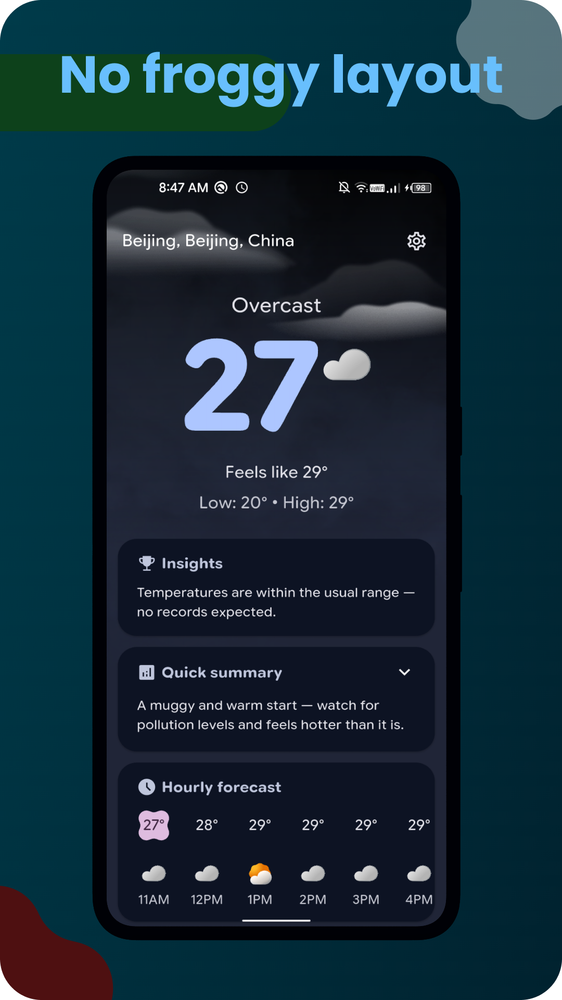
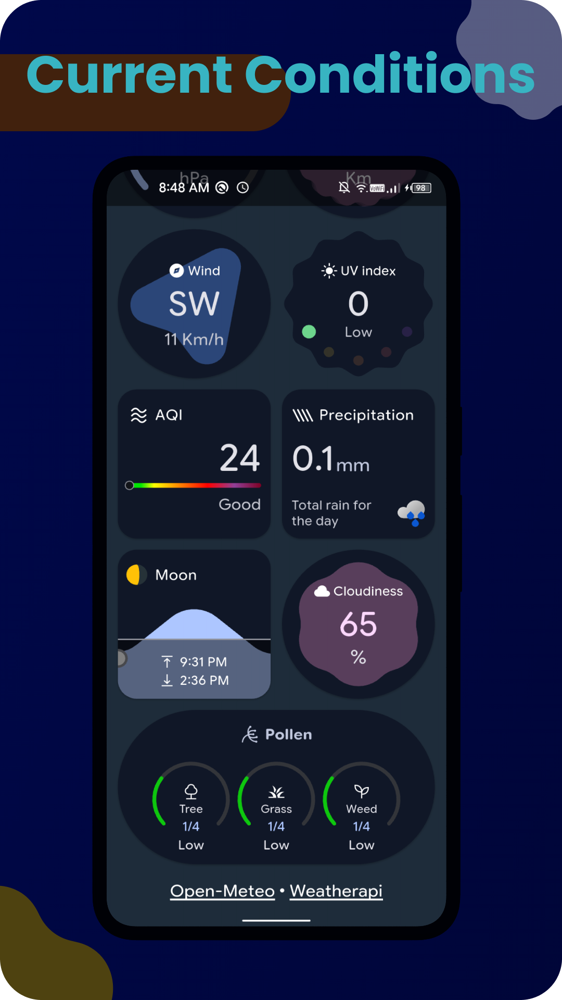
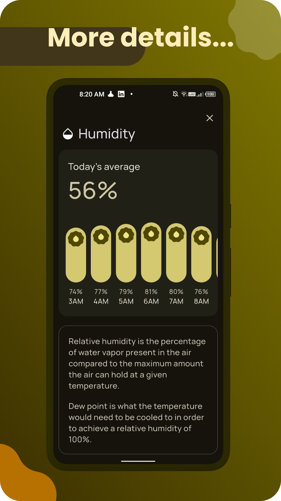
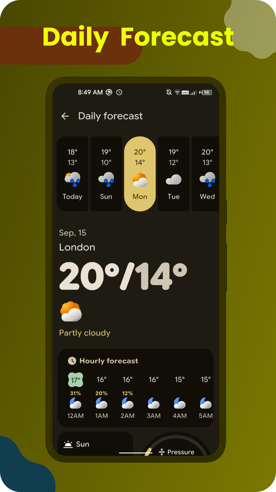
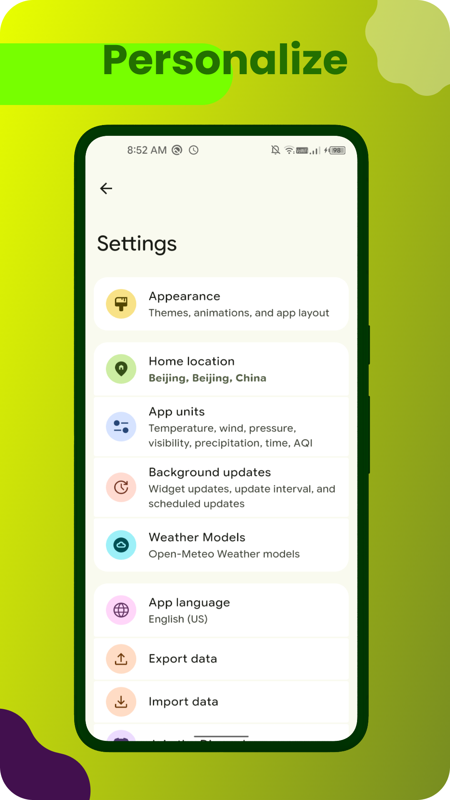

   

 
<h1 align="center">
 WeatherMaster
</h1>
   

      
      
       
      

   

   

   

   

   <h3>WeatherMaster: inspired by the Google Pixel weather app.</h3>

   

 

[Features](https://github.com/runtimepoet/WeatherMaster?tab=readme-ov-file#-features) • [Contact](https://github.com/runtimepoet/WeatherMaster?tab=readme-ov-file#%EF%B8%8F-contact) • [License](https://github.com/runtimepoet/WeatherMaster?tab=readme-ov-file#%EF%B8%8F-license)
 

 

# 👁️ Screenshots

 

# ✉️ Contact

For any questions or feedback, feel free to open an issue on GitHub or contact
runtimepoet910601@gmail.com

# ©️ License

This project is licensed under the GPL-3.0 license. See the `LICENSE` file for details.
